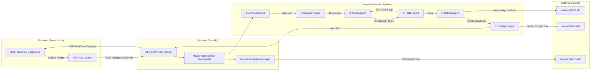

```text
               ___                    __  ______                      
              /   |  ____  ___  ____ / /_/ ____/___  _________  ___   
             / /| | / __ \/ _ \/ __ \ __/ /_  / __ \/ ___/ __ \/ _ \  
            / ___ |/ /_/ /  __/ / / / /_/ __/ / /_/ / /  /_/ /_/  __/  
           /_/  |_|\__, /\___/_/ /_/\__/_/    \____/_/  /_, /  \___/   
                  /____/                               /____/          
```

> AI-powered autonomous multi-agent compiler team for designing, generating, testing, publishing, and deploying production-ready agent applications.

---

## Table of Contents

- [What is AgentForze?](#what-is-agentforze)
- [Project Status](#project-status)
- [Features](#features)
- [How AgentForze Works](#how-agentforze-works)
- [Multi-Agent Architecture](#multi-agent-architecture)
- [Agent Execution Flow](#agent-execution-flow)
- [Project Structure](#project-structure)
- [Tech Stack](#tech-stack)
- [Architecture Diagram](#architecture-diagram)
- [API Reference](#api-reference)
- [Database](#database)
- [Storage](#storage)
- [Authentication](#authentication)
- [Environment Variables](#environment-variables)
- [Prerequisites](#prerequisites)
- [Quick Start](#quick-start)
- [Manual Setup](#manual-setup)
  - [Running Backend](#running-backend)
  - [Running Frontend](#running-frontend)
- [Development Workflow](#development-workflow)
- [Testing](#testing)
- [Generated Projects](#generated-projects)
- [Agent Memory and Context](#agent-memory-and-context)
- [GitHub Integration](#github-integration)
- [Deployment](#deployment)
  - [Vercel Deployment](#vercel-deployment)
- [Security](#security)
- [Troubleshooting](#troubleshooting)
- [Known Limitations](#known-limitations)
- [Contributing](#contributing)
- [License](#license)
- [Contributors](#contributors)

---

## What is AgentForze?

**AgentForze** is an autonomous multi-agent compiler platform designed to transform natural language system prompts into fully functional, tested, published, and deployed multi-agent applications.

### The Problem It Solves
Building multi-agent AI systems manually requires complex wiring, schema validation, code boilerplate creation, unit testing, git repository setup, and cloud infrastructure deployment. AgentForze automates the entire software engineering lifecycle through a 6-agent specialized compiler team powered by Google ADK and Gemini LLMs.

### Input & Output
- **Input**: Natural language description of a target multi-agent system (e.g., *"Build a Customer Support Triage system with specialized sub-agents for intent classification, sentiment analysis, and escalation routing"*).
- **Output**: Production-ready Python Google ADK codebase, automated test suites, synchronized GitHub repository, and live preview deployment on Vercel.

### End-to-End Compiler Pipeline
```text
User Idea (Prompt)
       │
       ▼
 1. Architect Agent ──► plan.json
       │
       ▼
 2. Designer Agent  ──► design.json
       │
       ▼
 3. Coder Agent     ──► generated/<project_name>/
       │
       ▼
 4. Tester Agent    ──► test_result.json  (Retry feedback loop to Coder on failure)
       │
       ▼
 5. GitHub Agent    ──► github_result.json (Remote Repository Push)
       │
       ▼
 6. Deployer Agent  ──► deployment_result.json (Vercel Cloud Deployment)
```

---

## Project Status

- **Core Pipeline (6 Agents)**: `Implemented` — Full 6-stage compiler workflow (`Architect`, `Designer`, `Coder`, `Tester`, `GitHub`, `Deployer`) is operational.
- **Single-Turn Structured Generation**: `Implemented` — Architect and Designer agents operate via direct single-turn JSON generation (~1.8s execution).
- **Round-Robin API Key Manager**: `Implemented` — Thread-safe rotation across 30 Gemini API keys to mitigate free-tier rate limits (`backend/roundRobin.py`).
- **Real-Time Streaming**: `Implemented` — FastAPI SSE streaming endpoint (`POST /api/pipeline/stream`) providing live progress updates.
- **React Control Center**: `Implemented` — Full interactive dashboard with hexagonal 6-node series pipeline visualization, real-time stage pulsing animations, FIFO Task Queue, locked prompt input, and task termination.
- **Database & Auth Persistence**: `Planned` — User authentication and persistent database storage via Supabase are planned for future iterations.

---

## Features

| Feature | Purpose | Implementation Location |
| :--- | :--- | :--- |
| **System Architecture Generation** | Transforms user ideas into structured architectural plans (`plan.json`) | [`backend/agents/architect_agent.py`](./backend/agents/architect_agent.py) |
| **Detailed Implementation Design** | Generates detailed agent contracts, data flow specs, and topology (`design.json`) | [`backend/agents/designer_agent.py`](./backend/agents/designer_agent.py) |
| **Google ADK Code Generation** | Instantiates project boilerplate, tool modules, and root agent logic | [`backend/agents/coder_agent.py`](./backend/agents/coder_agent.py) |
| **Automated Testing & Validation** | Runs 15-step validation suite including pytest execution and smoke tests | [`backend/agents/tester_agent.py`](./backend/agents/tester_agent.py) |
| **Automated GitHub Publishing** | Creates remote GitHub repository, stages code, commits, and pushes to main branch | [`backend/agents/github_agent.py`](./backend/agents/github_agent.py) |
| **Vercel Cloud Deployment** | Deploys backend API to Vercel and configures production environment variables | [`backend/agents/deployer_agent.py`](./backend/agents/deployer_agent.py) |
| **Round-Robin Key Rotation** | Rotates across 30 Gemini API keys to bypass rate limit bottlenecks | [`backend/roundRobin.py`](./backend/roundRobin.py) |
| **Real-Time SSE Pipeline Streaming** | Delivers real-time server-sent events for stage progress to the frontend | [`backend/api/routes.py`](./backend/api/routes.py) |
| **Interactive Hexagonal Dashboard** | Visualizes live agent flow with pulsating glowing nodes and completion banners | [`Frontend/artifacts/agentforge-frontend/src/pages/dashboard.tsx`](./Frontend/artifacts/agentforge-frontend/src/pages/dashboard.tsx) |
| **FIFO Task Queue & Lock Control** | Queues incoming prompts and provides multi-location task termination buttons | [`Frontend/artifacts/agentforge-frontend/src/pages/chat.tsx`](./Frontend/artifacts/agentforge-frontend/src/pages/chat.tsx) |

---

## How AgentForze Works

The AgentForze compiler team processes user ideas across 6 sequential stages:

| Stage | Input | Processing | Output | Next Stage |
| :--- | :--- | :--- | :--- | :--- |
| **1. Architect** | User Prompt | Analyzes goals, defines agents, responsibilities, tools, and topology | `plan.json` | Designer Agent |
| **2. Designer** | `plan.json` | Specifies model parameters, system prompts, inputs, outputs, error handling, and handoffs | `design.json` | Coder Agent |
| **3. Coder** | `plan.json`, `design.json` | Copies starter template from `backend/template/`, generates `agent.py`, tools, and FastAPI handlers | `generated/<project>/` | Tester Agent |
| **4. Tester** | `generated/<project>/` | Runs 15-step test matrix (schema checks, syntax checks, pytest execution, smoke tests) | `test_result.json` | GitHub Agent (or Coder on retry) |
| **5. GitHub** | `test_result.json` | Checks secret safety, creates remote GitHub repository via REST API, commits, and pushes code | `github_result.json` | Deployer Agent |
| **6. Deployer** | `github_result.json` | Registers Vercel project, injects `GEMINI_API_KEY`, triggers build, verifies live preview URL | `deployment_result.json` | Pipeline Complete |

---

## Multi-Agent Architecture

AgentForze is powered by 6 specialized agents, plus a Master Root Orchestrator:

| Agent | Responsibility | Input | Output |
| :--- | :--- | :--- | :--- |
| **Master Orchestrator** ([`root_agent.py`](./backend/agents/root_agent.py)) | Coordinates stage transitions, manages feedback retry loops, and aggregates final metrics | User Idea & Options | Full Pipeline Result Payload |
| **Architect Agent** ([`architect_agent.py`](./backend/agents/architect_agent.py)) | Generates system topology, agent responsibilities, and high-level wiring | User Idea | `docs/plan.json` |
| **Designer Agent** ([`designer_agent.py`](./backend/agents/designer_agent.py)) | Generates precise system prompts, model configs, tool definitions, and data contracts | `plan.json` | `docs/design.json` |
| **Coder Agent** ([`coder_agent.py`](./backend/agents/coder_agent.py)) | Generates Google ADK Python application code, tool functions, and FastAPI entrypoints | `plan.json`, `design.json` | `generated/<project_name>/` |
| **Tester Agent** ([`tester_agent.py`](./backend/agents/tester_agent.py)) | Validates project structure, executes pytest suite, scans for secret leaks, and runs smoke tests | Generated Codebase | `docs/test_result.json` |
| **GitHub Agent** ([`github_agent.py`](./backend/agents/github_agent.py)) | Initializes git repository, verifies secret safety, creates remote repository, and pushes code | `test_result.json`, Codebase | `docs/github_result.json` |
| **Deployer Agent** ([`deployer_agent.py`](./backend/agents/deployer_agent.py)) | Configures Vercel deployment, injects Gemini API key environment variables, and verifies live URL | `github_result.json`, Codebase | `docs/deployment_result.json` |

---

## Agent Execution Flow

```text
                         ┌────────────────────────┐
                         │   User Idea (Prompt)   │
                         └───────────┬────────────┘
                                     │
                                     ▼
                         ┌────────────────────────┐
                         │    Architect Agent     │
                         └───────────┬────────────┘
                                     │ (plan.json)
                                     ▼
                         ┌────────────────────────┐
                         │     Designer Agent     │
                         └───────────┬────────────┘
                                     │ (design.json)
                                     ▼
                         ┌────────────────────────┐
                         │      Coder Agent       │◄─────────────┐
                         └───────────┬────────────┘              │
                                     │ (generated code)          │ Feedback
                                     ▼                           │ Retry Loop
                         ┌────────────────────────┐              │ (max 3)
                         │      Tester Agent      │              │
                         └───────────┬────────────┘              │
                                     │                           │
                        ┌────────────┴────────────┐              │
                        │ Passed Validation?      │─── FAIL ─────┘
                        └────────────┬────────────┘
                                     │ YES
                                     ▼
                         ┌────────────────────────┐
                         │      GitHub Agent      │
                         └───────────┬────────────┘
                                     │ (github_result.json)
                                     ▼
                         ┌────────────────────────┐
                         │     Deployer Agent     │
                         └───────────┬────────────┘
                                     │ (deployment_result.json)
                                     ▼
                         ┌────────────────────────┐
                         │ Deployment Complete!   │
                         └────────────────────────┘
```

---

## Project Structure

```text
AgentForge/
├── backend/                        → Python FastAPI Backend & Google ADK Multi-Agent Core
│   ├── agent.py                    → Entrypoint wrapper for RootAgent pipeline
│   ├── agents/                     → Specialized 6-agent compiler team implementations
│   │   ├── architect_agent.py      → Architect Agent (Stage 1)
│   │   ├── designer_agent.py       → Designer Agent (Stage 2)
│   │   ├── coder_agent.py          → Coder Agent (Stage 3)
│   │   ├── tester_agent.py         → Tester Agent (Stage 4)
│   │   ├── github_agent.py         → GitHub Agent (Stage 5)
│   │   ├── deployer_agent.py       → Deployer Agent (Stage 6)
│   │   └── root_agent.py           → Master Orchestrator Agent
│   ├── api/                        → FastAPI web application & REST routes
│   │   ├── main.py                 → FastAPI app initialization & CORS setup
│   │   └── routes.py               → REST endpoints & SSE streaming handler
│   ├── config/                     → Application settings configuration
│   │   └── settings.yaml           → Default configuration parameters
│   ├── prompts/                    → Markdown system instructions for LLM agents
│   ├── roundRobin.py               → Thread-safe Gemini API key round-robin rotation manager
│   ├── schemas/                    → JSON Schema files validating pipeline artifacts
│   │   ├── plan_schema.json        → Schema for plan.json
│   │   ├── design_schema.json      → Schema for design.json
│   │   ├── coder_result_schema.json→ Schema for coder output
│   │   ├── test_result_schema.json → Schema for test results
│   │   ├── github_result_schema.json → Schema for GitHub results
│   │   └── deployment_result_schema.json → Schema for deployment results
│   ├── services/                   → External API integrations
│   │   ├── github_service.py       → GitHub REST API client wrapper
│   │   └── vercel_service.py       → Vercel REST API client wrapper
│   ├── template/                   → Starter boilerplate project copied for generated agents
│   │   ├── fast_api.py             → Template FastAPI app
│   │   └── vercel.json             → Template Vercel routing configuration
│   ├── tests/                      → Pytest test suite (89 unit/integration test cases)
│   └── tools/                      → Agent tool definitions (file, git, vercel, test execution)
├── docs/                           → Specifications, architectural blueprints, and ADRs
│   ├── PRD.md                      → Product Requirements Document
│   ├── architecture.md             → System architecture documentation
│   ├── implementation.md           → Current implementation details and changelog
│   ├── requirements.md             → Software requirements specification
│   ├── workflow.md                 → Multi-agent workflow specification
│   └── decisions/                  → Architecture Decision Records (ADRs)
├── Frontend/                       → React Frontend Workspace
│   └── artifacts/
│       └── agentforge-frontend/    → React 18 + Vite + TypeScript Dashboard
│           ├── src/
│           │   ├── components/     │   → UI components, layout shell, and modals
│           │   ├── hooks/          │   → Custom hooks (useForgeData)
│           │   ├── lib/            │   → TaskQueue FIFO data structure class
│           │   ├── pages/          │   → Dashboard pages (dashboard, chat, agents, deployment, etc.)
│           │   └── services/       │   → Axios API client definitions
│           ├── package.json        → Frontend node package dependencies
│           └── vite.config.ts      → Vite bundler configuration
├── generated/                      → Local workspace storage directory for generated agent systems
├── CHANGELOG.md                    → Project release notes and version history
├── run_support_triager_test.py     → Customer Support Triage verification test runner
└── start.sh                        → One-command concurrent startup script for Backend and Frontend
```

---

## Tech Stack

| Layer | Technology | Version / Details |
| :--- | :--- | :--- |
| **Agent Framework** | [Google ADK](https://github.com/google/adk) | `>=0.1.0` (Agent Development Kit) |
| **LLM Provider** | [Google Gemini](https://ai.google.dev/) | `gemini-3.5-flash` / `google-genai` SDK |
| **Backend API** | [FastAPI](https://fastapi.tiangolo.com/) | `>=0.100.0` with Uvicorn ASGI server |
| **Data Validation** | [Pydantic](https://docs.pydantic.dev/) & `jsonschema` | Pydantic v2 + JSON Schema Draft-07 |
| **Frontend Framework** | [React](https://react.dev/) | React 18 + TypeScript |
| **Build Tool** | [Vite](https://vitejs.dev/) | Vite 5 with `@vitejs/plugin-react` |
| **Styling & UI** | [TailwindCSS](https://tailwindcss.com/) & Radix UI | Dark-mode aesthetic with Lucide Icons |
| **Routing** | [Wouter](https://github.com/molefrog/wouter) | Lightweight React router |
| **HTTP Client** | [Axios](https://axios-http.com/) | Client for backend API communication |
| **Testing** | [Pytest](https://docs.pytest.org/) | Python testing framework (89 backend tests) |
| **Deployment Target** | [Vercel](https://vercel.com/) | Serverless Python deployment via `@vercel/python` |
| **Version Control** | [GitHub REST API](https://docs.github.com/en/rest) | Automated repository creation and git push |

---

## Architecture Diagram

### Pipeline Flow Diagram


### System Architecture Stack
```text
┌──────────────────────────────────────────────────────────┐
│                   React 18 Dashboard                     │
│    (Wouter Router · TailwindCSS · Lucide · Axios)        │
└────────────────────────────┬─────────────────────────────┘
                             │ HTTP / SSE Stream
                             ▼
┌──────────────────────────────────────────────────────────┐
│                   FastAPI Backend API                    │
│       (CORS Middleware · SSE Streaming Routes)           │
└────────────────────────────┬─────────────────────────────┘
                             │
                             ▼
┌──────────────────────────────────────────────────────────┐
│               AgentForge Master Orchestrator             │
│        (Round-Robin Gemini Key Rotation Manager)         │
└──────┬──────────┬───────────┬───────────┬───────────┬────┘
       │          │           │           │           │
       ▼          ▼           ▼           ▼           ▼
  Architect   Designer      Coder       Tester      GitHub      Deployer
    Agent       Agent       Agent       Agent       Agent        Agent
       │          │           │           │           │            │
       ▼          ▼           ▼           ▼           ▼            ▼
   plan.json  design.json  Codebase  test_result  GitHub Repo  Vercel App
```

---

## API Reference

The FastAPI backend exposes the following RESTful endpoints:

### General & Pipeline Endpoints

| Method | Endpoint | Purpose | Request Body / Parameters | Response |
| :--- | :--- | :--- | :--- | :--- |
| `GET` | `/` | Root API metadata and documentation links | None | JSON object with service details |
| `GET` | `/api/health` | Health check endpoint | None | `{"status": "ok", ...}` |
| `POST` | `/api/pipeline/run` | Execute full multi-agent pipeline synchronously | `{"user_idea": "...", "project_name": "..."}` | Full execution payload |
| `POST` | `/api/pipeline/stream` | Stream pipeline execution with real-time SSE events | `{"user_idea": "...", "project_name": "...", ...}` | Server-Sent Event stream |
| `POST` | `/api/pipeline/cancel` | Cancel an active pipeline stream | `{"project_name": "..."}` | `{"status": "cancelled"}` |

### Stage-Specific Endpoints

| Method | Endpoint | Purpose | Request Body | Response |
| :--- | :--- | :--- | :--- | :--- |
| `POST` | `/api/agents/architect` | Execute Stage 1 (Architect Agent) | `{"user_idea": "...", "project_name": "..."}` | `plan.json` result |
| `POST` | `/api/agents/designer` | Execute Stage 2 (Designer Agent) | `{"project_name": "..."}` | `design.json` result |
| `POST` | `/api/agents/coder` | Execute Stage 3 (Coder Agent) | `{"project_name": "..."}` | `coder_result.json` |
| `POST` | `/api/agents/tester` | Execute Stage 4 (Tester Agent) | `{"project_name": "..."}` | `test_result.json` |
| `POST` | `/api/agents/github` | Execute Stage 5 (GitHub Agent) | `{"project_name": "..."}` | `github_result.json` |
| `POST` | `/api/agents/deployer` | Execute Stage 6 (Deployer Agent) | `{"project_name": "...", "gemini_api_key": "..."}` | `deployment_result.json` |

### Project Management Endpoints

| Method | Endpoint | Purpose | Request Body / Parameters | Response |
| :--- | :--- | :--- | :--- | :--- |
| `GET` | `/api/projects` | List all generated projects | None | List of project summaries |
| `GET` | `/api/projects/{name}` | Get detailed project summary | Path parameter: `name` | Detailed project metadata |
| `GET` | `/api/projects/{name}/agents` | List project agents | Path parameter: `name` | Agent definitions list |
| `GET` | `/api/projects/{name}/design` | Get project design artifact | Path parameter: `name` | `design.json` content |
| `GET` | `/api/projects/{name}/flow` | Get agent topology flow graph | Path parameter: `name` | Node/edge graph JSON |
| `GET` | `/api/projects/{name}/files` | List project directory file tree | Path parameter: `name` | File tree hierarchy |
| `GET` | `/api/projects/{name}/files/{path}` | Read specific project file content | Path parameters: `name`, `path` | Raw file text |
| `PUT` | `/api/projects/{name}/files/{path}` | Save updated project file content | Path parameters: `name`, `path`; Body: `{"content": "..."}` | `{"status": "saved"}` |
| `GET` | `/api/projects/{name}/execution` | Get project execution status | Path parameter: `name` | Execution state JSON |
| `GET` | `/api/projects/{name}/execution/logs` | Fetch execution logs | Path parameter: `name` | Log text lines |
| `POST` | `/api/projects/{name}/start` | Start generated project process | Path parameter: `name` | Process status |
| `POST` | `/api/projects/{name}/stop` | Stop generated project process | Path parameter: `name` | Process status |
| `GET` | `/api/projects/{name}/github` | Get GitHub repository metadata | Path parameter: `name` | Repository URL & state |
| `GET` | `/api/projects/{name}/deployment` | Get Vercel deployment metadata | Path parameter: `name` | Deployment URL & status |

---

## Database

- **Current Implementation**: `Not currently implemented`.
- **Workspace State Management**: Generated projects and artifact files are persisted locally within `generated/<project_name>/` and session states are managed in memory via Google ADK's `InMemorySessionService`.
- **Planned Roadmap**: Persistent user account management, project history, and template storage via Supabase PostgreSQL are planned for future releases.

---

## Storage

Workspace files and persistent compilation artifacts are stored on the local filesystem:

- **Generated Project Workspace**: `generated/<project_name>/`
- **Compiler Artifacts Directory**: `generated/<project_name>/docs/`
  - `plan.json` — System architecture plan
  - `design.json` — Detailed implementation design
  - `coder_result.json` — Code generation metrics
  - `test_result.json` — 15-step validation report
  - `github_result.json` — Repository push metadata
  - `deployment_result.json` — Vercel deployment credentials and live URL

---

## Authentication

- **User Authentication**: `Not currently implemented` on backend API or dashboard endpoints.
- **Service API Authentication**:
  - **GitHub API**: Authenticates via `GITHUB_TOKEN` (Bearer token header) for remote repository creation and push operations.
  - **Vercel API**: Authenticates via `VERCEL_TOKEN` (Bearer token header) for serverless deployment and environment variable provisioning.
  - **Gemini API**: Authenticates via `GEMINI_API_KEY` / `GOOGLE_API_KEY` with automated round-robin rotation across 30 configured environment keys (`GEMINI_API_KEY1` .. `GEMINI_API_KEY30`).

---

## Environment Variables

### Environment Variable Matrix

| Location | Variable Name | Required | Purpose | Safe in Frontend? |
| :--- | :--- | :--- | :--- | :--- |
| **Root / Backend** | `GEMINI_API_KEY` | Yes | Primary Google Gemini API key for LLM generation | ❌ **Server Only** |
| **Root / Backend** | `GOOGLE_API_KEY` | Optional | Fallback Google Gemini API key | ❌ **Server Only** |
| **Root / Backend** | `GEMINI_API_KEY1` .. `30` | Optional | Round-robin API key pool for rate limit rotation | ❌ **Server Only** |
| **Root / Backend** | `GEMINI_MODEL` | Optional | Target LLM model name (default: `gemini-3.5-flash`) | ❌ **Server Only** |
| **Root / Backend** | `GITHUB_TOKEN` | Yes | GitHub Personal Access Token for repo creation | ❌ **Server Only** |
| **Root / Backend** | `VERCEL_TOKEN` | Yes | Vercel API token for automated deployment | ❌ **Server Only** |
| **Backend** | `API_HOST` | Optional | FastAPI bind address (default: `0.0.0.0`) | ❌ **Server Only** |
| **Backend** | `API_PORT` | Optional | FastAPI bind port (default: `8000`) | ❌ **Server Only** |
| **Frontend** | `VITE_API_BASE_URL` | Optional | Base URL for FastAPI backend (default: `/api`) | ✅ **Frontend Exposed** |

> [!IMPORTANT]
> Never commit `.env` files containing actual API keys or personal access tokens to version control. Always copy `.env.example` to `.env` and fill in placeholders locally.

---

## Prerequisites

Ensure you have the following software installed before running AgentForze:

- **Python**: `>=3.10`
- **Node.js**: `>=18.0.0`
- **Package Manager**: `pnpm` (or `npx pnpm`)
- **Git**: Installed and configured locally
- **Google Gemini API Key**: At least one active Gemini API key from [Google AI Studio](https://aistudio.google.com/)
- **GitHub Personal Access Token**: PAT with `repo` scopes for automated repository creation
- **Vercel API Token**: Vercel token for serverless deployment management

---

## Quick Start

The fastest way to launch AgentForze is using the root startup script [`start.sh`](./start.sh):

```bash
# 1. Clone repository
git clone https://github.com/BharathPESU/AgentForge.git
cd AgentForge

# 2. Configure environment variables
cp .env.example .env
# Edit .env with your GEMINI_API_KEY, GITHUB_TOKEN, and VERCEL_TOKEN

# 3. Make start.sh executable and run
chmod +x start.sh
./start.sh
```

The script will automatically install dependencies and launch:
- **Backend API**: `http://localhost:8000`
- **Swagger Documentation**: `http://localhost:8000/docs`
- **React Frontend Dashboard**: `http://localhost:5173`

---

## Manual Setup

### Running Backend

```bash
# Navigate to project root
cd AgentForge

# Create and activate Python virtual environment
python3 -m venv venv
source venv/bin/activate

# Install Python dependencies
pip install -r backend/requirements.txt

# Run FastAPI backend server
PYTHONPATH=. python3 -m uvicorn backend.api.main:app --host 0.0.0.0 --port 8000 --reload
```

### Running Frontend

```bash
# Navigate to Frontend directory
cd AgentForge/Frontend/artifacts/agentforge-frontend

# Install dependencies using pnpm
pnpm install

# Start Vite development server
pnpm dev
```

---

## Development Workflow

1. **Modify Code**: Make edits in `backend/` or `Frontend/artifacts/agentforge-frontend/src/`.
2. **Type Checking**: Run `pnpm typecheck` in the frontend directory to verify TypeScript types.
3. **Execute Backend Tests**: Run `pytest backend/tests/` to verify backend agent functionality.
4. **Commit & Push**: Commit changes following semantic commit conventions and push to GitHub.

---

## Testing

Backend test suites are implemented with `pytest` in [`backend/tests/`](./backend/tests/):

```bash
# Run complete backend test suite (89 unit/integration tests)
PYTHONPATH=. pytest backend/tests/
```

### Test Coverage
- **Architect Agent Tests**: [`backend/tests/test_architect.py`](./backend/tests/test_architect.py)
- **Designer Agent Tests**: [`backend/tests/test_designer.py`](./backend/tests/test_designer.py)
- **Coder Agent Tests**: [`backend/tests/test_coder.py`](./backend/tests/test_coder.py)
- **Tester Agent Tests**: [`backend/tests/test_tester.py`](./backend/tests/test_tester.py)
- **GitHub Agent Tests**: [`backend/tests/test_github.py`](./backend/tests/test_github.py)
- **Deployer Agent Tests**: [`backend/tests/test_deployer.py`](./backend/tests/test_deployer.py)
- **Root Agent Tests**: [`backend/tests/test_root.py`](./backend/tests/test_root.py)
- **API Endpoint Tests**: [`backend/tests/test_api.py`](./backend/tests/test_api.py)
- **Round-Robin Manager Tests**: [`backend/tests/test_round_robin.py`](./backend/tests/test_round_robin.py)

---

## Generated Projects

When AgentForze builds a target system, it generates an isolated workspace directory inside `generated/<project_name>/`:

```text
generated/support_triager/
├── docs/
│   ├── plan.json                 → Architect system plan
│   ├── design.json               → Designer detailed specification
│   ├── coder_result.json         → Coder execution summary
│   ├── test_result.json          → Tester 15-step validation report
│   ├── github_result.json        → GitHub repository metadata
│   └── deployment_result.json    → Vercel live deployment credentials
├── agent.py                      → Main Google ADK agent application
├── fast_api.py                   → FastAPI entrypoint for generated agent
├── requirements.txt              → Python dependencies for generated agent
├── vercel.json                   → Vercel serverless deployment routing config
└── .env                          → Local environment file containing GEMINI_API_KEY
```

---

## Agent Memory and Context

- **Execution Session Memory**: AgentForze isolates execution state per session using Google ADK's `InMemorySessionService`.
- **Contract-Based Artifact Passing**: Agents communicate deterministically by reading and writing structured JSON artifacts (`plan.json` $\rightarrow$ `design.json` $\rightarrow$ `test_result.json` $\rightarrow$ `github_result.json` $\rightarrow$ `deployment_result.json`).
- **Feedback Retry Memory**: If Tester Agent validation fails, failure details are passed directly back to Coder Agent for iterative code correction (up to 3 retries).

---

## GitHub Integration

The `GitHubAgent` ([`backend/agents/github_agent.py`](./backend/agents/github_agent.py)) automates Git operations:

1. **Secret Scanning**: Scans codebase to prevent committing raw secrets or tokens.
2. **Repository Creation**: Calls GitHub REST API (`POST /user/repos`) to create remote repository.
3. **Git Initialization**: Initializes git in `generated/<project_name>/`, stages files, and commits.
4. **Remote Push**: Authenticates in memory via `x-access-token` header and pushes code to remote `main` branch.

---

## Deployment

### Vercel Deployment

The `DeployerAgent` ([`backend/agents/deployer_agent.py`](./backend/agents/deployer_agent.py)) manages serverless deployment:

1. **Project Provisioning**: Registers project via Vercel REST API (`POST /v9/projects`).
2. **Environment Variable Injection**: Direct server-side injection of `GEMINI_API_KEY` into Vercel production environment (`POST /v10/projects/{id}/env`).
3. **Deployment Trigger**: Creates Vercel deployment using `@vercel/python` framework configuration (`POST /v13/deployments`).
4. **Live Verification**: Polls deployment state and verifies live preview URL accessibility.

---

## Security

- **Environment Secret Protection**: Secret keys (`GITHUB_TOKEN`, `VERCEL_TOKEN`, `GEMINI_API_KEY`) are kept on the server and never exposed to the frontend React bundle.
- **Pre-Commit Secret Scanning**: `GitHubAgent` scans code for API key patterns prior to committing.
- **In-Memory Git Authentication**: GitHub push operations inject tokens into git push command URLs dynamically in memory without saving credentials to local `.git/config`.
- **Untrusted Code Warning**: Generated agent applications should be inspected prior to execution in production environments.

---

## Troubleshooting

| Symptom | Cause | Solution |
| :--- | :--- | :--- |
| **`429 RESOURCE_EXHAUSTED`** | Gemini API free-tier rate limit reached | Add additional Gemini keys as `GEMINI_API_KEY1`..`30` in `.env` for automatic round-robin rotation. |
| **`401 UNAUTHENTICATED`** | Invalid `GITHUB_TOKEN` or `VERCEL_TOKEN` | Verify token validity and scopes in `.env`. Ensure GitHub PAT has `repo` permission. |
| **Backend connection error in frontend** | FastAPI backend not running on port 8000 | Run `./start.sh` or execute `python3 -m uvicorn backend.api.main:app --port 8000` manually. |
| **Vite build / typecheck failure** | Missing node modules or mismatched types | Run `pnpm install` in `Frontend/artifacts/agentforge-frontend` directory. |
| **Pytest execution failure** | Missing `PYTHONPATH` | Run pytest with `PYTHONPATH=. pytest backend/tests/`. |

---

## Known Limitations

1. **Unauthenticated API**: Backend endpoints (`/api/*`) currently do not enforce user authentication tokens or authorization headers.
2. **Local Storage**: Generated workspaces are stored on local disk under `generated/` rather than a cloud object store.
3. **Process Context**: Process execution controls (`/start`, `/stop`) trigger local subprocesses.

---

## Contributing

Contributions are welcome! Please follow these steps:

1. Fork the repository on GitHub.
2. Create a feature branch (`git checkout -b feature/my-feature`).
3. Commit your changes (`git commit -m 'feat: add my new feature'`).
4. Verify backend tests (`PYTHONPATH=. pytest backend/tests/`) and frontend types (`pnpm typecheck`).
5. Push to the branch (`git push origin feature/my-feature`).
6. Open a Pull Request.

---

## License

This project is licensed under the **Apache License 2.0**.
*Note: A formal [`LICENSE`](./LICENSE) file should be added to the root directory.*

---

## Contributors

- **Balaraj R** — Founder
- **Bharath CD** — Co-founder
